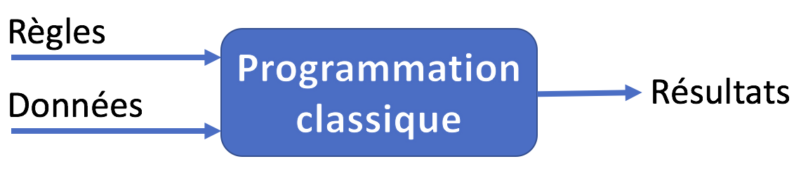
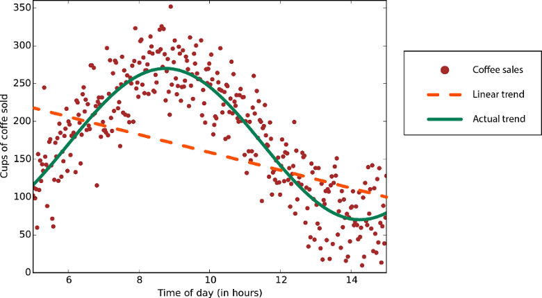

## Sommaire

- ...
- Régression linéaire
- Régression logistique

---

> "The field of study that gives computers the ability to learn without being explicitly programmed" (Arthur Samuel, 1959).

---

## Un nouveau paradigme

{}{}

{}{}

---

---

---

{}

## Apprentissage supervisé

Les résultats à obtenir sont fournis avec les données d'entraînement.

Ces données sont dites **structurées** (étiquetées).

---

## Régression

Le système prédit des valeurs **continues**.

---

## Classification

Le système prédit des valeurs discrètes : il **catégorise** les entrées.

{}

---

## Apprentissage non supervisé

Le système doit découvrir par lui-même une éventuelle structure dans les données (fournies sans les résultats à obtenir).

---

## Apprentissage par renforcement

Les décisions du système lui procurent une **récompense** qu'il cherche à maximiser. 

---

TODO
