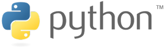

### Sommaire

* Introduction à Python
* Calcul mathématique avec NumPy
* Analyse de données avec Pandas
* Création de graphiques avec Matplotlib et Seaborn
* Installation simplifiée avec Anaconda
* Partage de code avec Jupyter Notebook

---

### Introduction à Python

---

### Le langage Python

Langage de programmation sous licence libre créé en 1989 par [Guido van Rossum](https://fr.wikipedia.org/wiki/Guido_van_Rossum).

* Multi-paradigmes (procédural, fonctionnel, objet)
* Typage dynamique
* Gestion automatique de la mémoire

---

### La syntaxe de Python

TODO

---

### Python, le standard pour la Data Science

* Qualités du langage (logique, simplicité, souplesse)
* Implication de la communauté scientifique et universitaire
* Existence de nombreuses bibliothèques dédiées

---

TODO