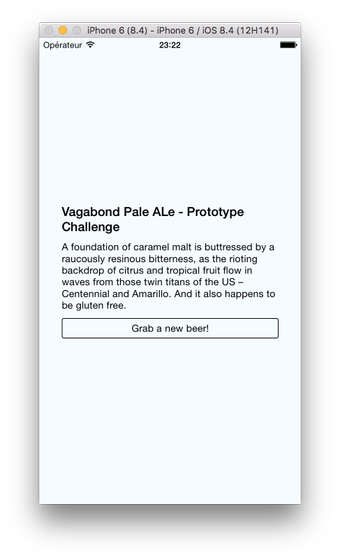

### Sommaire

* L'écosystème mobile
* Le JavaScript moderne
* Premiers pas avec React Native

---

### L'écosystème mobile

---

{}


---


{}

---

{}

### Développement natif

Création d'applications en utilisant la technologie prévue par le concepteur de l'OS.

* Android : Java
* IOS : Objective-C ou Swift

{}Ces technologies sont **incompatibles**.{}

---

### Avantages

* Accès à l'intégralité des fonctionnalités matérielles et logicielles du terminal mobile.
* Performances optimales.

---

### Inconvénient (majeur !)

Nécessité de créer puis de faire évoluer une application pour chaque environnement.

{}

---

{}

### Solutions hybrides

Création d'applications mobiles compatibles avec plusieurs OS mobiles grâce à un framework dédié.

Une application hybride est une application web qui s'exécute à l'intérieur d'un navigateur.

Exemples : [Apache Cordova](https://cordova.apache.org), [Ionic](https://ionicframework.com)

---

### Avantages

* Fonctionnalités et performances proches de celles d'une application native.
* Economies de ressources pour créer l'application.
* Une seule base de code : maintenance et évolution facilitées.

---

### Inconvénients

* Impossible d'accéder à certaines fonctionnalités matérielles ou logicielles spécifiques.
* *Look'n'feel* non natif.
* Mauvaises performances dans certains scenarii.

{}

---

{}

### Développement natif multi-plateformes

Création d'applications mobiles compatibles avec plusieurs OS mobiles grâce à un framework dédié.

Le framework encapsule les véritables composants natifs de l'OS.

Exemples : [React Native](https://facebook.github.io/react-native/), [Weex](https://weex.apache.org/), [Xamarin](https://www.visualstudio.com/fr/xamarin/)

---

### Le meilleur des deux mondes ?

Combine les avantages du natif (*look'n'feel*, performances) et de l'hybride (une seule base de code).

Limite potentielle : le support de l'OS dépend entièrement du framework.

{}

---

### Le JavaScript moderne

---

### Un pré-requis essentiel

La majorité des solutions mobiles multi-plateformes est basée sur JavaScript.


---

{}

### Les évolutions du langage

JavaScript est normalisé sous le nom **ECMAScript**.


La norme **ES2015** (ou ES6) a apporté de très nombreuses améliorations au langage.

---

### Let et const

Les mots-clés `let` et `const` remplacent avantageusement `var` pour la déclaration des variables.

La valeur d'une variable déclarée avec `const` ne peut plus être modifiée.

```js
let a = 3.14;
a = 6.28; // OK

const b = 3.14;
b = 6.28; // Erreur!
```

---

### Litéraux de modèle

Chaînes de caractères créées entre *backticks* \`...\` et permettant d'intégrer des expressions.

```js
const country = "France";
console.log(`I live in ${country}`); // "I live in France"
```

---

### Fonctions fléchées

Nouvelle syntaxe pour créer des fonctions anonymes.

```js
// Syntaxe classique
const hello = function(name) {
  const message = `Hello, ${name}!`;
  return message;
};

// Utilisation d'une fonction fléchée
const hello = (name) => {
  const message = `Hello, ${name}!`;
  return message;
};

console.log(hello("Richard")); // "Bonjour, Richard!"
```

---

### Classes

```js
class Character {
  constructor(name, health, strength) {
    this.name = name;
    this.health = health;
    this.strength = strength;
  }
  describe() {
    return `${this.name} has ${this.health} health points
      and ${this.strength} as strength`;
  }
}

const aurora = new Character("Aurora", 150, 25);
console.log(aurora.describe());
```

---

### Appels asynchrones

Une **promesse** (*promise*) est un objet qui encapsule une opération dont le résultat n'est pas encore connu.

```js
// Envoie une requête HTTP asynchrone vers l'URL spécifiée
fetch(url)
  .then(() => {
    // Code appelé ultérieurement si la requête réussit
  })
  .catch(() => {
    // Code appelé ultérieurement si la requête échoue
  });
```

---

### Consommation d'API web

```js
// Envoi d'une requête HTTP asynchrone vers l'URL spécifiée
// La réponse est reçue sous forme de données JSON
fetch("http://my-api-url")
  .then(response => response.json()) // JSON vers JavaScript
  .then(content => {
    // Utilisation de la réponse
    // ...
  })
  .catch(err => {
    console.error(err.message);
  });
```

---

### Modules et imports

JavaScript supporte la notion de **module** pour factoriser des éléments réutilisables.

```js
// Importe l'élément exporté par défaut par le module
import React from 'react-native';

// Importe d'autres éléments exportés grâce à leur nom
import {View, Text, Image} from 'react-native';

// Importe à la fois l'élément par défaut et d'autres éléments
import React, {View, Text, Image} from 'react-native';
```

{}

---

### Les outils

* Gestion des dépendances : [npm](https://www.npmjs.com/) ou [yarn](https://yarnpkg.com/lang/en/).
* Edition du code : [Visual Studio Code](https://code.visualstudio.com/).
* Formatage du code : [Prettier](https://github.com/prettier/prettier).
* Analyse du code : [ESLint](https://eslint.org/).

---

### Premiers pas avec React Native

---

### React Native

Framework créé par Facebook, open source depuis 2015.

Déclinaison mobile du framework JavaScript [React](https://reactjs.org/).


---

{}

### Création d'une application

Utilisation de l'outil [Create React Native App](https://github.com/react-community/create-react-native-app) associé à l'application mobile [Expo](https://expo.io) pour le déploiement.

```bash
# Avec npm
npm install -g create-react-native-app
create-react-native-app MyApp
cd MyApp
npm start
```

```bash
# Avec yarn (https://yarnpkg.com/blog/2017/05/12/introducing-yarn/)
yarn create react-native-app MyApp
cd MyApp
yarn start
```

---

### Contenu du répertoire créé


---

### Le fichier principal App.js

```jsx
import React from 'react';
import { StyleSheet, Text, View } from 'react-native';

export default class App extends React.Component {
  render() {
    return (
      <View style={styles.container}>
        <Text>Hello World!</Text>
      </View>
    );
  }
}

const styles = StyleSheet.create({
  container: {
    flex: 1,
    backgroundColor: '#fff',
    alignItems: 'center',
    justifyContent: 'center',
  },
});
```

{}

---

{}

### La notion de composant

Les **composants** sont les blocs de base d'une application React (Native).

Ils permettent de créer une UI sous forme **déclarative** par assemblage de composants.

---

### Propriétés d'un composant

Caractéristiques définies au moment de sa création et immuables ensuite (immutables).

```jsx
class Greeting extends Component {
  render() {
    return (
      <Text>Hello {this.props.name}!</Text>
    );
  }
}

export default class LotsOfGreetings extends Component {
  render() {
    return (
      <View style={{alignItems: 'center'}}>
        <Greeting name='John' />
        <Greeting name='Paul' />
        <Greeting name='Jones' />
      </View>
    );
  }
}
```

---

### Etat d'un composant

Etat interne (données) d'un composant, susceptible de changer au cours du temps (mutable).

```jsx
class Counter extends Component {
  constructor(props) {
    super(props);
    this.state = {count: 0};
    setInterval(() => {
      this.setState({count: this.state.count + 1})
    }, 1000);
  }

  render() {
    const {count} = this.state;
    const {color, size} = this.props;

    return (
      <Text style={{color, fontSize: size}}>
        {count}
      </Text>
    )
  }
}

export default class CounterApp extends Component {
  render() {
    return (
      <View style={styles.container}>
        <Counter color={'red'} size={30} />
      </View>
    );
  }
}
```

{}

---

### Exemple d'application

<https://github.com/ensc-mobi/RandomBeer>
