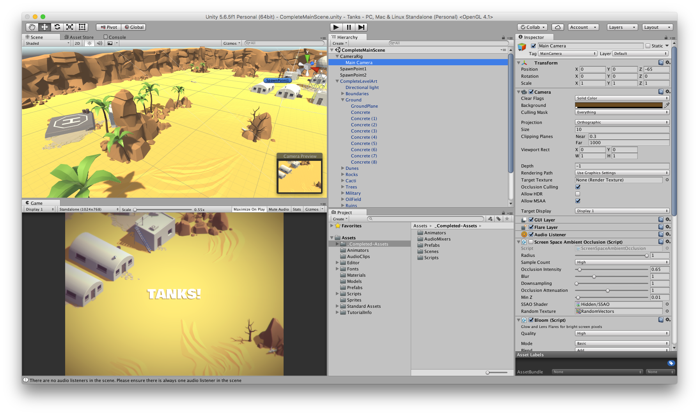
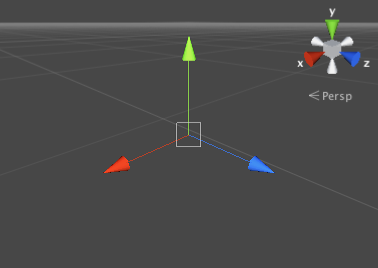

## Sommaire

- Unity en bref
- L'éditeur Unity
- Concepts-clés

---

## Unity en bref

---

- Moteur de jeu développé par [Unity Technologies](https://en.wikipedia.org/wiki/Unity_Technologies) depuis 2004.
- Multiplateformes (PC, Mac, consoles, smartphones, web).
- [Licence personnelle](https://store.unity.com/fr/products/unity-personal) gratuite.

---



---

## L'éditeur Unity

---

---

---

## Concepts-clés

---

## Project

- Peut être de type 2D ou 3D.
- Correspond physiquement à un répertoire stocké localement ou dans le *cloud*.

---

{}

## Asset

- Ressource utilisable dans Unity.
- Nombreux types possibles : image, modèle 3D, fichier audio, etc.

---

## Packages

- Plusieurs assets peuvent être regroupés dans un **package**.
- Unity est livré avec une collections d'**assets standards** : formes de base, gestion de la caméra, des entrées utilisateur, etc.

---

## Asset Store

- Magasin en ligne proposant de nombreux assets gratuits ou payants.
- Permet d'importer des packages dans un projet.

{}

---

## Scene

- Correspond à un niveau du jeu.
- Sauvegardées parmi les assets.

---

{}

## GameObject

- Objet qui représente un élément d'une scène Unity.
- Constitué d'un ensemble de **composants**.

---

### Hiérarchie des GameObjects

- Il est possible de regrouper des objets pour former des hiérarchies parent/enfants à plusieurs niveaux.
- Permet de définir des propriétés communes ou de refléter des relations de composition entre objets.

{}

---

{}

## Composant

Ajoute un comportement à un GameObject.

---

## Le composant Transform

Définit la position, l'orientation et l'échelle d'un GameObject.

---

## Transform et hiérarchie

- Position, orientation et échelle d'un GameObject sont relatives à son parent dans la hiérarchie.
- Les valeurs de Transform sont relatives à celles du GameObject parent (**coordonnées locales**) ou absolues en l'absence de parent (**coordonnées globales**).

{}

---

## Mesh

TODO

---

## Collider

TODO

---

## Script

TODO
