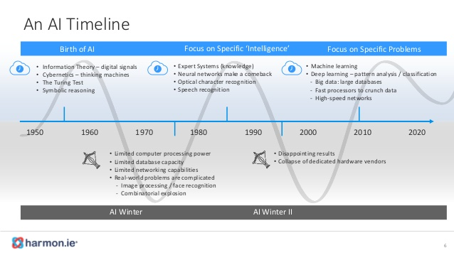
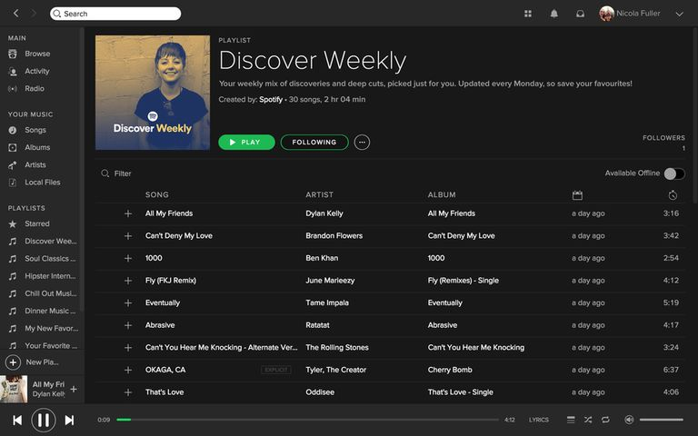
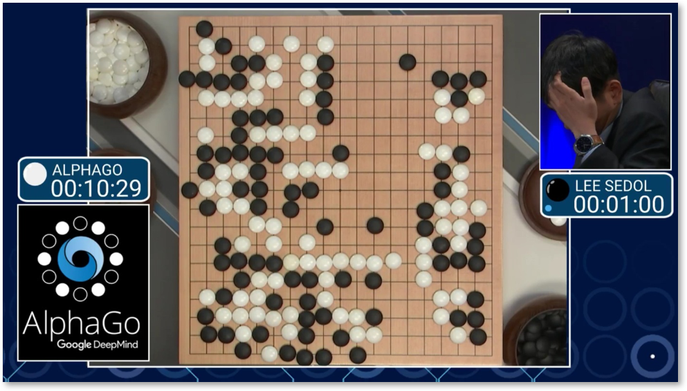
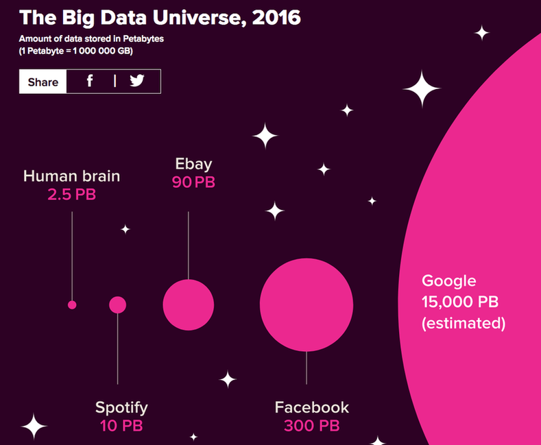

## Sommaire

- Définition(s) de l'IA
- Histoire de l'IA
- ...
- L'avènement du Deep Learning
- Le futur de l'IA

---

## Intelligence artificielle

> "L'IA consiste à parvenir à faire faire aux machines ce que l’homme fait aujourd’hui mieux qu’elles, notamment s’adapter, apprendre, communiquer et interagir d’une manière riche et variée avec leur environnement."

(Source : [#FranceIA](https://www.economie.gouv.fr/France-IA-intelligence-artificielle))

---

## De nombreux domaines d'étude

- Logique et raisonnement
- Bases de connaissances, Web sémantique
- Apprentissage automatique
- Traitement du langage naturel
- Robotique
- Sciences cognitives
- Aide à la décision
- ...

(Source : [INRIA](https://www.inria.fr/actualite/actualites-inria/livre-blanc-sur-l-intelligence-artificielle))

---

## Une histoire jeune et mouvementée

---

## L'été, jusqu'à quand ?

---

TODO

---

## L'avènement du Deep Learning

---

---

## Apprentissage automatique

(_Machine Learning_)

Ensemble de techniques permettant à des machines de **s’entraîner** sur des bases d’exemples, d’en faire émerger des traits, de généraliser sur des exemples non encore rencontrés et de **s'améliorer** continuellement avec l’expérience.

---

{}

## Apprentissage profond

(_Deep Learning_)

Ensemble de techniques d’apprentissage automatique dans lesquels de vastes réseaux de neurones artificiels exploitent de grandes quantités de données.

A l'origine de la majorité des avancées récentes en IA.

---

## Reconnaissance visuelle

---

## Compréhension de la parole

---

## Véhicules autonomes



---

## Algorithmes de recommandation

---

## Jeux complexes

{}

---

{}

## Les clés du succès

- L'optimisation d'algorithmes connus depuis les années 1980
- L'augmentation de la puissance de calcul des machines
- L'explosion du volume de données disponibles

---

## L'état de l'art au début des années 1990

<http://yann.lecun.com/exdb/lenet/>

---

---

{}

---

## Le futur de l'IA

---

TODO
