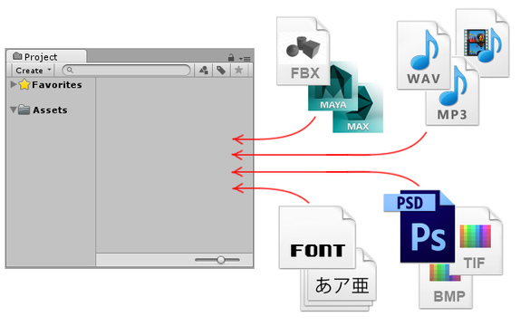
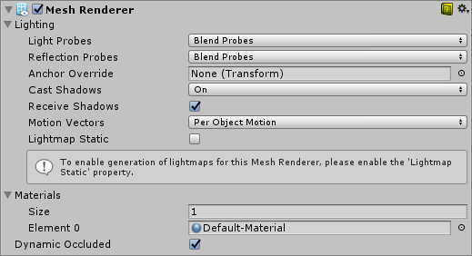
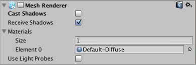
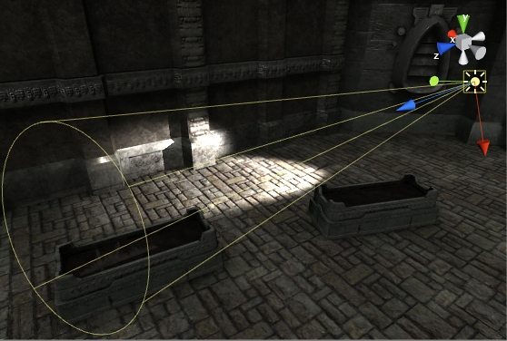
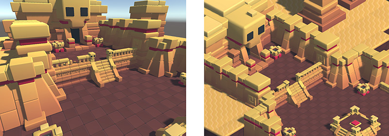
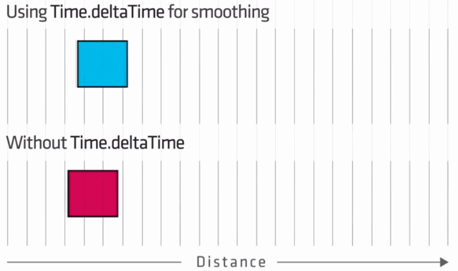

## Sommaire

- Unity en bref
- Concepts-clés
- Versionnage d'un projet

---

## Unity en bref

---


- Moteur de jeu développé par [Unity Technologies](https://en.wikipedia.org/wiki/Unity_Technologies) depuis 2004.
- Multiplateformes : PC, Mac, consoles, smartphones, web.
- [Licence personnelle](https://store.unity.com/fr/products/unity-personal) gratuite.

---

## Made with Unity



---


---


---


---

## Concepts-clés

---

## Project

- Rassemble tous les éléments constituant le jeu.
- Peut être de type 2D ou 3D.
- Correspond physiquement à un répertoire stocké localement ou dans le *cloud*.


---

{}

## Asset

- Ressource utilisable dans un projet.
- Nombreux types possibles : image, modèle 3D, texture, fichier audio, script, etc.



---

## Packages

- Plusieurs Assets peuvent être regroupés dans un **package**.
- Unity est livré avec une collections d'**Assets standards** : formes de base, gestion de la caméra, des entrées utilisateur, etc.

---

## Asset Store

- Magasin en ligne proposant de nombreux Assets gratuits ou payants.
- Permet d'importer des packages dans un projet.


{}

---

## Scene

- Correspond à une partie du jeu (un niveau).
- Sauvegardées parmi les Assets.


---

{}

## GameObject

- Objet qui représente un élément d'une scène.
- Constitué d'un ensemble de **composants**.


---

### Hiérarchie des GameObjects

- Création de hiérarchies parent/enfants à plusieurs niveaux en regroupant des GameObjects.
- Permet de refléter des relations de **dépendance** ou de **composition** entre objets.


{}

---

{}

## Composant

Ajoute un comportement à un GameObject.


---

## Le composant Transform

Définit la position, la rotation et l'échelle d'un GameObject.


---

## Transform et hiérarchie

- Position, rotation et échelle d'un GameObject sont relatives à son parent dans la hiérarchie.
- Les valeurs de Transform sont relatives à celles du GameObject parent (**coordonnées locales**) ou absolues en l'absence de parent (**coordonnées globales**).

{}

---

{}

## Mesh

Maillage géométrique d'une forme 3D.


---

## Mesh renderer

Composant assurant le rendu d'un Mesh à la position définie par le composant Transform du GameObject.



{}

---

## RigidBody

Composant permettant à un GameObject de réagir selon les lois de la physique :

- Gestion de la masse, de la gravité, etc.
- Application de forces.
- Réaction aux collisions.


---

{}

## Collider

Composant définissant la forme d'un GameObject pour la gestion des collisions :

- **Primitive Collider** : formes géométriques de base (cube, sphère, cylindre, etc).
- **Mesh Collider** : forme spécifique définie par un Mesh. Plus coûteux en temps de calcul.

Par défaut, des GameObjects possédant un Collider ne peuvent pas se chevaucher.

---

## RigidBody Collider

GameObject possédant un Collider et un RigidBody.

- Soumis aux lois de la physique.
- Déclenche des collisions avec les autres (non-Trigger) Colliders.
- Doit être déplacé en lui appliquand des forces.

---

## Static Collider

GameObject possédant un Collider mais pas de RigidBody.

- Déclenche des collisions avec les RigidBody Colliders, mais ne bouge pas.
- Ne doit pas être déplacé.
- Destiné aux éléments immobiles de la scène (murs, obstacles, etc).

---

## Kinematic RigidBody Collider

GameObject possédant un Collider et un RigidBody défini comme Kinematic.

- N'est pas soumis aux lois de la physique.
- Déclenche des collisions avec les RigidBody Colliders, mais ne bouge pas.
- Peut être déplacé en modifiant son Transform.
- Destiné aux éléments animés du décor (portes, objets à récupérer, etc).

---

## Trigger Collider

GameObject dont le Collider est défini comme Trigger.


- Autorise le chevauchement sans déclencher de collision.
- Permet de définir une **zone** et de réagir lorsque des RigidBody Colliders y pénètrent.

---
[](https://docs.unity3d.com/Manual/CollidersOverview.html)

{}

---

## Prefab

- Type d'Asset permettant d'instancier des GameObjects à partir d'un modèle commun.
- Changements d'un Prefab appliqués à toutes ses instances.
- Une instance de Prefab peut aussi être modifiée individuellement.



---

## Light

Type de GameObject permettant d'ajouter une source de lumière à la scène.



---

## Camera

Type de GameObject qui calcule la vue de la scène affichée au joueur.



---

{}

## Script

- Type d'Asset permettant de coder le comportement d'un GameObject en langage C# ou UnityScript.
- Doit faire partie des composants du GameObject.
- Peut accéder aux propriétés du GameObject définies par ses autres composants.

---

## Anatomie d'un script

```csharp
// ... (directives using)

// MonoBehaviour : superclasse de tous les scripts Unity
public class MainPlayer : MonoBehaviour {
    // Appelée juste avant le rendu de la première image
    void Start() { ... }

    // Appelée à chaque nouvelle image
    // L'intervalle de temps entre deux appels peut varier
    void Update() { ... }

    // Appelée à intervalles réguliers (0.02s par défaut)
    void FixedUpdate() { ... }
}
```

---

## Déplacements scriptés

[](https://unity3d.com/fr/learn/tutorials/topics/scripting/delta-time)

{}

---

## Versionnage d'un projet

---

## Le problème

- Taille de certains Assets.
- Nombreux fichiers binaires dans un projet : modèles 3D, images, sons, etc.

---

## Les solutions

{}Partage manuel (disque commun, Drive, etc). ; Dépôt Git standard. ; Git LFS.{}

---

{}

## Git Large File System

[](https://git-lfs.github.com)

---

## Fichier .gitattributes

```bash
* text=auto

# Unity files
*.meta -text -merge=unityamlmerge
*.unity -text -merge=unityamlmerge
*.asset -text -merge=unityamlmerge
*.prefab -text -merge=unityamlmerge

# Image formats
*.psd filter=lfs diff=lfs merge=lfs -text
*.jpg filter=lfs diff=lfs merge=lfs -text
*.png filter=lfs diff=lfs merge=lfs -text
*.gif filter=lfs diff=lfs merge=lfs -text
*.bmp filter=lfs diff=lfs merge=lfs -text
*.tga filter=lfs diff=lfs merge=lfs -text
*.tiff filter=lfs diff=lfs merge=lfs -text
*.iff filter=lfs diff=lfs merge=lfs -text
*.pict filter=lfs diff=lfs merge=lfs -text
*.dds filter=lfs diff=lfs merge=lfs -text
*.xcf filter=lfs diff=lfs merge=lfs -text

# Audio formats
*.mp3 filter=lfs diff=lfs merge=lfs -text
*.ogg filter=lfs diff=lfs merge=lfs -text
*.wav filter=lfs diff=lfs merge=lfs -text
*.aiff filter=lfs diff=lfs merge=lfs -text
*.aif filter=lfs diff=lfs merge=lfs -text
*.mod filter=lfs diff=lfs merge=lfs -text
*.it filter=lfs diff=lfs merge=lfs -text
*.s3m filter=lfs diff=lfs merge=lfs -text
*.xm filter=lfs diff=lfs merge=lfs -text

# Video formats
*.mov filter=lfs diff=lfs merge=lfs -text
*.avi filter=lfs diff=lfs merge=lfs -text
*.asf filter=lfs diff=lfs merge=lfs -text
*.mpg filter=lfs diff=lfs merge=lfs -text
*.mpeg filter=lfs diff=lfs merge=lfs -text
*.mp4 filter=lfs diff=lfs merge=lfs -text

# 3D formats
*.fbx filter=lfs diff=lfs merge=lfs -text
*.obj filter=lfs diff=lfs merge=lfs -text
*.max filter=lfs diff=lfs merge=lfs -text
*.blend filter=lfs diff=lfs merge=lfs -text
*.dae filter=lfs diff=lfs merge=lfs -text
*.mb filter=lfs diff=lfs merge=lfs -text
*.ma filter=lfs diff=lfs merge=lfs -text
*.3ds filter=lfs diff=lfs merge=lfs -text
*.dfx filter=lfs diff=lfs merge=lfs -text
*.c4d filter=lfs diff=lfs merge=lfs -text
*.lwo filter=lfs diff=lfs merge=lfs -text
*.lwo2 filter=lfs diff=lfs merge=lfs -text
*.abc filter=lfs diff=lfs merge=lfs -text
*.3dm filter=lfs diff=lfs merge=lfs -text

# Build
*.dll filter=lfs diff=lfs merge=lfs -text
*.pdb filter=lfs diff=lfs merge=lfs -text
*.mdb filter=lfs diff=lfs merge=lfs -text

# Packaging
*.zip filter=lfs diff=lfs merge=lfs -text
*.7z filter=lfs diff=lfs merge=lfs -text
*.gz filter=lfs diff=lfs merge=lfs -text
*.rar filter=lfs diff=lfs merge=lfs -text
*.tar filter=lfs diff=lfs merge=lfs -text

```

[Source](https://gist.github.com/bpesquet/4e28b431b673addef1774d497b614b33)

---

## GitHub For Unity

<https://unity.github.com/>

- Extension qui intègre Git et GitHub dans Unity.
- Authentification GitHub, LFS, etc.
- Version 1.0 : encore instable.

{}